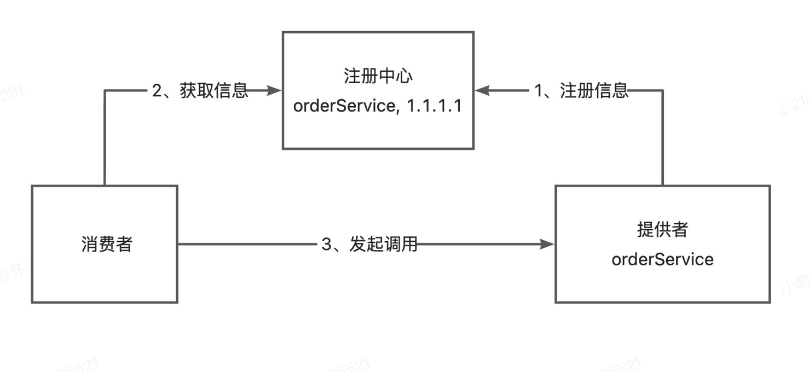
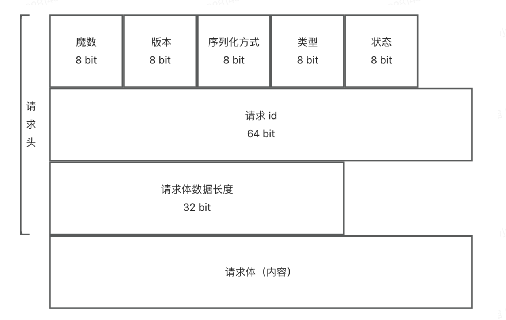

# rpc框架实现
通过rpc(remote procedure call), 远程过程调用, 去实现像调用本地方法一样去跨进程调用

## rpc示例
1. 服务提供者
    provider-UserService
2. 服务消费者
    consumer, 获取远程类的代理对象, 然后直接调用类的方法调用远程方法
3. 公共接口
    消费者和提供者通过公共接口去发现同一个服务对象
4. web服务器
    Tomcat, Netty, Vert.x
5. 服务提供者的本地服务注册器
    根据服务名从ConcurrentHashMap中获取对应的实现类
6. 序列化与反序列化
    JDK序列化: Object对象序列化成byte数组, 需要对象实现serializable
7. 请求处理器
    vertx通过Handler<HttpServerRequest>实现请求处理
    处理接收到的请求, 找到对应的服务和方法, 反射实现调用, 封装结果并响应
    需要的参数: 服务名, 方法名, 参数类型, 参数列表
8. 响应处理器
    返回请求结果
    包含的参数: 数据, 数据类型, 异常, 提示消息

## 优化1: 全局配置加载
通过定义PRCConfig类, 写入默认配置, 在application.properties覆盖默认配置, 通过Hutool-Props工具类完成Config加载, 通过双检锁单例模式创建单例Config对象

## 优化2: 提供mock服务
定义全局配置, 是否使用mock, 然后在动态代理时读取mock配置, 并根据返回类型生成mock数据 

## 优化3: 使用不同的序列化器
第一种: JDK自带序列化实现
第二种: JSON序列化 可读性好, 但是数据量较大, 不能处理复杂的数据结构和循环引用
第三种: protobuf 二进制序列化, 数据量小
第四种: Hessian 二进制序列化, 传输效率高, 但必须实现Serializable接口
第五种: Kryo 只有Java, 速度快, 兼容性高
其他: 用户自定义实现, 通过**SPI机制**实现插件化扩展
> SPI机制: 服务提供者通过特定的配置文件将用户实现注册到系统中, 并通过反射机制动态加载这些实现, 在不修改框架代码的情况下实现解耦和扩展(例如JDBC驱动开发, ORM, Spring)
原生实现/自定义SPI实现(详细了解)
在META-INF下定义扫描的文件, 文件内是用户和系统定义的序列化器全类名, rpc初始化时会在指定路径下读取这些类, 并在使用时创建对象实例(单例对象, 存储在ConcurrentHashMap中), 通过RPCConfig可以指定使用的序列化器

## 优化4: 注册中心

1. 注册信息的存储、读取和共享
2. 服务注册: 服务提供者注册服务到注册中心
3. 服务发现: 从注册中心拉取服务信息
4. 心跳检测: 监测服务提供者状态
5. 服务注销: 删除失效节点
ZooKeeper, Redis, Etcd
云原生中间件Etcd实现注册中心, 开源分布式键值存储系统(用于k8s)
**为什么要使用Etcd?**
简单的过期机制, 数据监听和通知机制, key-value存储, 层次化键存储数据(类似文件系统, 支持前缀查询, 范围查询)
租约机制: 租约过期时(TTL超时), 键值对自动删除
监听机制: 键发生变化时, 触发响应通知
支持事务和分布式一致性算法Raft

使用jetcd操作etcd, 常见的客户端
1. kvClient 操作键值对
2. leaseClient: 分配生存时间等
3. watchClient: 监听键的变化
4. clusterClient/electionClient: 实现集群管理和选举功能
etcd的键是带有版本号的, 可以实现乐观锁, 一致性, 可靠性

./etcd 启动etcd
./etcdkeeper, 浏览器可视化展示etcd

服务提供者在本地LocalRegistry注册方法后, 在注册中心注册自己的方法 and 地址, 并创建Vertx服务器, 供服务调用者调用

服务调用者从Etcd中根据类名+版本查询服务提供者的地址, 然后通过动态代理(这里的代理为null, 是正常的, 因为访问的是invoke方法)发送HTTP请求, 得到结果

## 优化5: 服务的心跳检测和优雅退出
设置服务中心key过期时间, 自动退出
设置定时任务, 每10秒(小于过期时间, 容错)重新注册一遍节点, 实现心跳监测
定义JVM的ShutDown Hook钩子, 在退出前主动取消注册的服务
(消费者服务信息缓存, 通过watch机制监听变化/失效的key, 然后清除本地缓存, 未实现完全)

## 优化6: 容错机制
分布式系统的各个组件可能存在网络故障等异常情况, 系统出现错误触发

1. 故障转移: 切换一个节点再次调用
2. 失败自动恢复: 系统出现失败时, 及时恢复正常
3. 静默处理: 非重要功能异常, 直接忽略
4. 快速失败: 交给调用方处理
重试, 限流, 降级(使用其他服务), 熔断, 超时控制

先容错再重试: 
先重试再容错: 系统错误(网络波动, 临时不可用) 先重试

## 优化7: 重试机制
固定时间重试
指数退避重试, 重试时间指数增加
随机延迟重试
可变延迟重试, 根据之前重试的成功/失败情况, 挑中下一次重试的延迟时间

重试次数达到上线/超时停止

通过实现Callable接口, 然后在出现异常时retry call方法, 根据不同的策略实现重试
## 优化8: 负载均衡
https://www.codefather.cn/什么是负载均衡/

轮询
随机
加权轮询(根据服务器性能/权重分配)
加权随机
最小连接数(连接最少的服务器, 适用于长连接)
IP hash(根据用户IP hash值选择服务器)

本rpc采用轮询, 随机, 一致性hash实现, 一致性hash通过treeMap获取下一个虚拟节点
可以通过rpcConfig配置策略

## 优化9: 自定义网络传输协议
基于TCP, 目前采用的是HTTP实现RPC, 包含请求头, 消息头, 头信息比较大, 可以修改为更加高效的协议
需要的信息
1. magic num
2. 版本号
3. 序列化方式
4. 类型
5. 状态
6. 请求id
7. 请求体
8. 请求体数据长度(防止粘包问题)

   (仿Dubbo)
根据协议字段, 包装RPC请求, encode/decode
通过RecordParser分两阶段读取请求, 并采用装饰器模式, 解决粘包/半包问题
